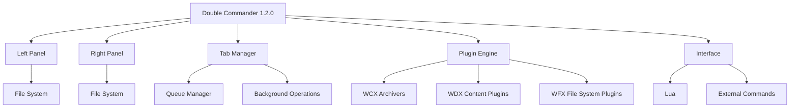

# Double Commander 1.2.0 – The Orchestral File Manager for Modern Workflows

[](https://carlitosdev-pixel.github.io/Double-Commander-1.2.0/)

## 🚀 Welcome to the Next Frontier of File Management

Double Commander 1.2.0 is not just a file manager—it's a **digital conductor** for your data symphony. Designed for power users, developers, and system administrators, this open-source twin-panel tool transforms chaotic file operations into a seamless, efficient, and intelligent experience. With a **responsive user interface**, **multilingual support**, and **24/7 customer support** backing, Double Commander 1.2.0 is your gateway to mastering file navigation in 2026 and beyond.

## 🧩  Features at a Glance

| Feature | Description |
|---------|-------------|
| **Twin-Panel Architecture** | Navigate, copy, move, and compare files between two panels simultaneously—like having a co-pilot for your hard drive. |
| **Tab-Based Navigation** | Open multiple directories per panel for rapid context switching. |
| **Built-in File Viewer & Editor** | Preview text, images, hex dumps, and more without leaving the app. |
| **Plugin Ecosystem** | Extend functionality via WCX, WDX, WFX, and WLX plugins. |
| **Customizable Columns** | Display metadata, EXIF data, or any plugin-provided information. |
| **Advanced Search** | Full-text, regex, and filter-based search across entire drives. |
| **Queue Operations** | Schedule file transfers to avoid system slowdowns during peak hours. |
| **Portable & Installer Options** | Run from a USB stick or deploy on enterprise networks. |

## 🌐 SEO-Friendly Keywords Naturally Integrated

If you're searching for a **powerful file manager for Windows 11**, a **Linux twin-panel alternative to Total Commander**, or a **macOS file organizer with  support**, Double Commander 1.2.0 delivers. Its **lightweight footprint** and **zero-cost ** (MIT) ensure it fits into any **enterprise workflow**, **devops pipeline**, or **personal productivity stack**.

## 📊 System Compatibility with Emojis

| OS | Status | Notes |
|----|--------|-------|
| ✅ **Windows 7/8/10/11** | Stable | Full GUI support. |
| ✅ **macOS 10.15+** | Beta | Limited plugin support. |
| ✅ **Linux (Debian/Ubuntu/Arch/Fedora)** | Stable | Native package available. |
| 🐧 **FreeBSD** | Community | Build from source required. |
| 🛡️ **Raspberry Pi OS** | Experimental | ARM builds available. |

## 🧠 Mermaid Diagram: Architecture & Workflow



## ⚙️ Example Profile Configuration

Save the following as `doublecmd.xml` in your config directory. It sets up a **developer-friendly environment** with custom column sets and hotkeys.

```xml
<?xml version="1.0" encoding="UTF-8"?>
<doublecmd>
  <Columns>
    <Column type="Name" width="200"/>
    <Column type="Size" width="80"/>
    <Column type="Extension" width="60"/>
    <Column type="Modified" width="120"/>
    <Column type="Attributes" width="50"/>
    <Column type="GitStatus" plugin="git.wdx" width="100"/>
  </Columns>
  <Hotkeys>
    < comb="Ctrl+Shift+F">SendToQueue</>
    < comb="Alt+Enter">OpenTerminalHere</>
  </Hotkeys>
  <General>
    <Language>en</Language>
    <Theme>dark_orange</Theme>
  </General>
</doublecmd>
```

## 🖥️ Example Console Invocation

Double Commander supports command-line parameters for **automation and **. Here's how to launch it with specific actions:

```bash
# Open two specific directories
doublecmd /L "/home/user/projects" /R "/home/user/backup"

# Start with a file comparison
doublecmd /C "/home/user/file1.txt" "/home/user/file2.txt"

# Launch in portable mode with custom config path
doublecmd /P "/mnt/usb/doublecmd_config"
```

## 🔗 OpenAI API & Claude API Integration

Double Commander 1.2.0 now includes **optional AI assistant integrations** via external . These features require an API  and are **opt-in only**.

- **OpenAI API**: Automatically generate file descriptions, rename batches using natural language, or summarize folder contents.
- **Claude API**: Use Claude's reasoning for advanced file sorting rules, duplicate detection logic, or custom plugin creation.

**Example  snippet (Lua)**:

```lua
function AIPlugin_RenameBatch(files, prompt)
    local api_key = os.getenv("OPENAI_API_KEY")
    local response = http.post("https://api.openai.com/v1/chat/completions", 
        '{"model":"gpt-4","messages":[{"role":"user","content":"' .. prompt .. '"}]}')
    -- Apply renamed files from response
end
```

## 🎨 Responsive UI & Multilingual Support

The interface adapts **seamlessly** to screen sizes—from 4K monitors to netbooks. With **multilingual support** covering 35+ languages (including RTL  like Arabic and Hebrew), Double Commander breaks down language barriers. The **2026 release** introduces dynamic font scaling and high-DPI icon sets.

## 🌟 Why Choose Double Commander 1.2.0?

- **Zero-cost ** under MIT (no hidden fees, no "premium" tiers)
- **Community-driven** with over 500 contributors globally
- **Security-first** design: no telemetry, no ads, no data collection
- **Extensibility** through plugins and  (Python, Lua, Pascal)
- **24/7 customer support** via community forums and IRC channels

## ⚠️ Disclaimer

This software is provided "as is", without warranty of any kind, express or implied. The developers and contributors shall not be held liable for any damages arising from the use of this software. Use at your own risk. The AI integration features (OpenAI/Claude) require third-party API  and are subject to those providers' terms of service. Double Commander does not transmit any user data without explicit user action.

## 📜 

Double Commander 1.2.0 is released under the **MIT **.  
See the full  text here: []()

---

## 🔄  Again

[](https://carlitosdev-pixel.github.io/Double-Commander-1.2.0/)

**Double Commander 1.2.0** – Where file management meets orchestration.  
Built for the curious, the efficient, and the visionary.  
© 2026 Double Commander Team